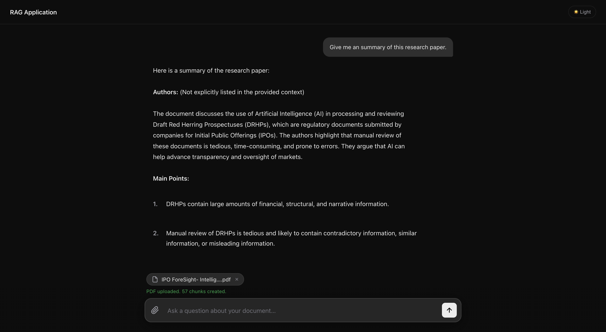
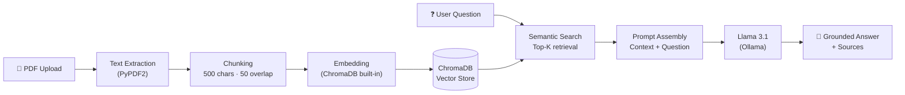
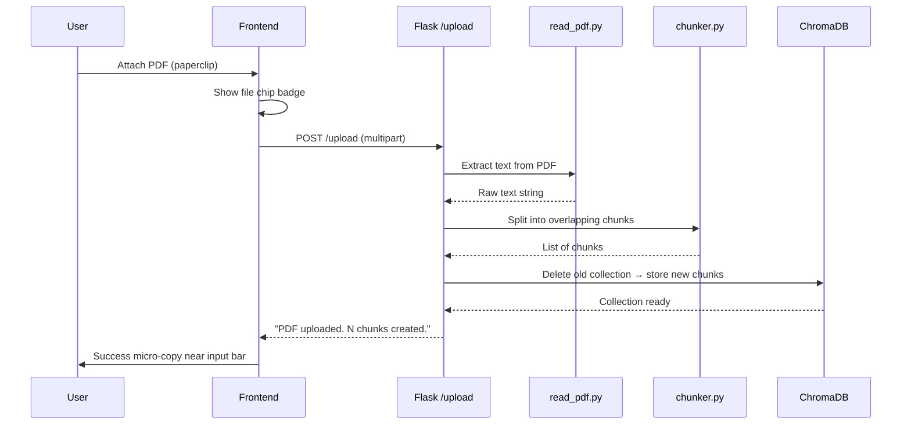
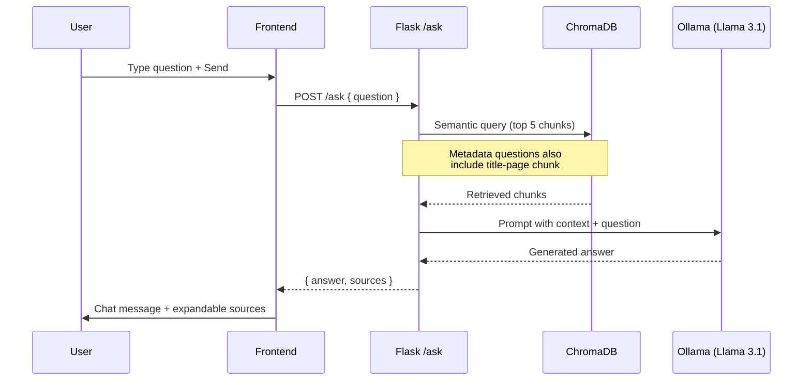
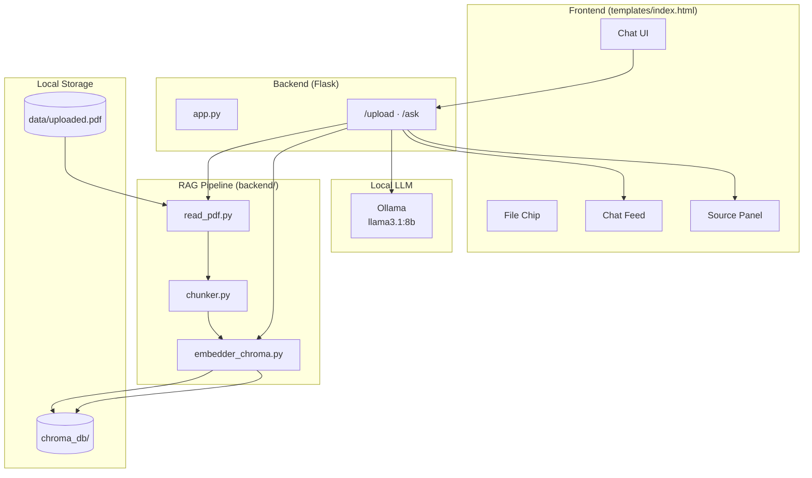

# RAG-Based Document Q&A System

A full-stack **Retrieval-Augmented Generation (RAG)** web app that lets you upload any PDF and chat with it. Ask questions in natural language — the system retrieves relevant passages from your document and generates grounded answers using a local LLM.



> **100% local · No paid APIs · Privacy-first** — your documents never leave your machine.

---

## Table of Contents

- [Overview](#overview)
- [Features](#features)
- [How It Works](#how-it-works)
- [Architecture](#architecture)
- [Project Structure](#project-structure)
- [Tech Stack](#tech-stack)
- [Setup](#setup)
- [Usage](#usage)
- [API Reference](#api-reference)
- [Author](#author)

---

## Overview

Traditional chatbots answer from general knowledge. This app answers **only from the PDF you upload** — making it ideal for research papers, reports, prospectuses, and technical documents.

The pipeline extracts text, splits it into overlapping chunks, embeds them into **ChromaDB**, retrieves the most relevant chunks for each question, and passes them as context to **Llama 3.1** via **Ollama**.

---

## Features

| Feature | Description |
|---------|-------------|
| **Chat-first UI** | Modern, minimalist interface inspired by ChatGPT / Perplexity |
| **PDF upload** | Attach any PDF via paperclip — auto-indexed on upload |
| **Semantic search** | ChromaDB finds the most relevant document chunks per question |
| **Source transparency** | Expandable source chunks show exactly what context was retrieved |
| **Smart metadata retrieval** | Author/title/abstract questions automatically include the title page |
| **Dark mode** | Polished dark theme with light-mode toggle |
| **Fully offline** | Flask + ChromaDB + Ollama — zero cloud API costs |

---

## How It Works

### End-to-end RAG pipeline



### Upload flow



### Question & answer flow



---

## Architecture



---

## Project Structure

```
RAG Application/
├── app.py                  # Flask server — routes & orchestration
├── requirements.txt        # Python dependencies
├── assets/
│   └── screenshot.png      # App preview image
├── backend/
│   ├── read_pdf.py         # PDF text extraction (PyPDF2)
│   ├── chunker.py          # Sliding-window text chunking
│   ├── embedder_chroma.py  # ChromaDB store & retrieve
│   ├── embedder_st.py      # Alternative: Sentence-Transformers embeddings
│   └── answer.py           # Standalone CLI answer script
├── templates/
│   └── index.html          # Chat-first frontend
├── data/                   # Uploaded PDFs (gitignored)
└── chroma_db/              # Vector database (gitignored)
```

---

## Tech Stack

| Layer | Technology |
|-------|-----------|
| **Frontend** | HTML, CSS, JavaScript (vanilla) |
| **Backend** | Python 3.11, Flask |
| **PDF parsing** | PyPDF2 |
| **Vector DB** | ChromaDB (persistent, local) |
| **Embeddings** | ChromaDB default embedding model |
| **LLM** | Llama 3.1 8B via Ollama |
| **Chunking** | Custom sliding window (500 chars, 50 overlap) |

---

## Setup

### Prerequisites

- Python 3.11+
- [Ollama](https://ollama.com/) installed and running

### 1. Clone the repository

```bash
git clone https://github.com/Suyog1407/Rag-Application.git
cd Rag-Application
```

### 2. Create and activate a virtual environment

```bash
python3 -m venv venv
source venv/bin/activate        # macOS / Linux
# venv\Scripts\activate         # Windows
```

### 3. Install dependencies

```bash
pip install -r requirements.txt
```

### 4. Pull the LLM model

```bash
ollama pull llama3.1:8b
```

### 5. Run the application

```bash
python app.py
```

### 6. Open in browser

```
http://127.0.0.1:5000
```

---

## Usage

1. **Attach a PDF** — click the paperclip icon in the input bar and select your document.
2. **Wait for indexing** — a status message appears (e.g. `PDF uploaded. 57 chunks created.`).
3. **Ask a question** — type anything about the document and press Enter or the send button.
4. **Review sources** — click **Sources · N chunks** below any answer to see retrieved passages.

### Example questions

- *"Give me a summary of this research paper."*
- *"Who are the authors?"*
- *"What is the main contribution of this work?"*
- *"What methodology was used?"*

---

## API Reference

### `POST /upload`

Upload and index a PDF.

| Field | Type | Description |
|-------|------|-------------|
| `pdf` | file | PDF file (multipart form) |

**Response:**
```json
{ "message": "PDF uploaded. 57 chunks created." }
```

---

### `POST /ask`

Ask a question about the uploaded document.

**Request body:**
```json
{ "question": "What is this document about?" }
```

**Response:**
```json
{
  "answer": "This document is about...",
  "sources": ["chunk text 1", "chunk text 2", "..."]
}
```

---

## Author

**Suyog Kshirsagar**

- LinkedIn: [linkedin.com/in/suyog-kshirsagar](https://linkedin.com/in/suyog-kshirsagar)
- GitHub: [github.com/Suyog1407](https://github.com/Suyog1407)

---

<p align="center">
  <sub>Built with Flask · ChromaDB · Ollama · PyPDF2</sub>
</p>
